# Cloud Services

This section gives pricing for a cloud setup for the company and discusses backup strategies utilising the cloud.

[Pricing](#pricing-for-cloud-services) | [Backup](#backup-strategies) | [Plan](./plan.md) | [Network Design](./network.md) | [Security](./security.md) | [Reflection](./reflection.md) | [Return to index](./README.md)

## Pricing for Cloud Services

Okay, So in this section we will be discussing About the Servers for Web Computing and Backup Servers.
For this section we have estimated the pricing for Web servers and Cloud Backup servers from 2 providers.
These 2 are specifically **Google Cloud** and **AWS**.

So lets Start With **Google Cloud**:

**Google Cloud Web Server**:

In the Instances selection we selected only one because we need only 1 web server.The operating system we slected was linux type:
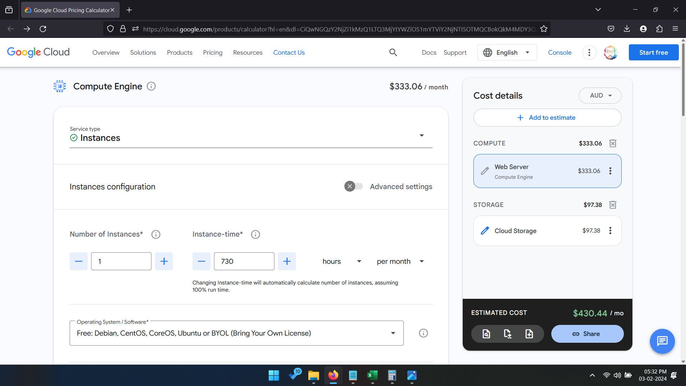
In the Machine Type we selected 4 VCPUS and 15 gibs of ram because we felt that it will be sufficient.
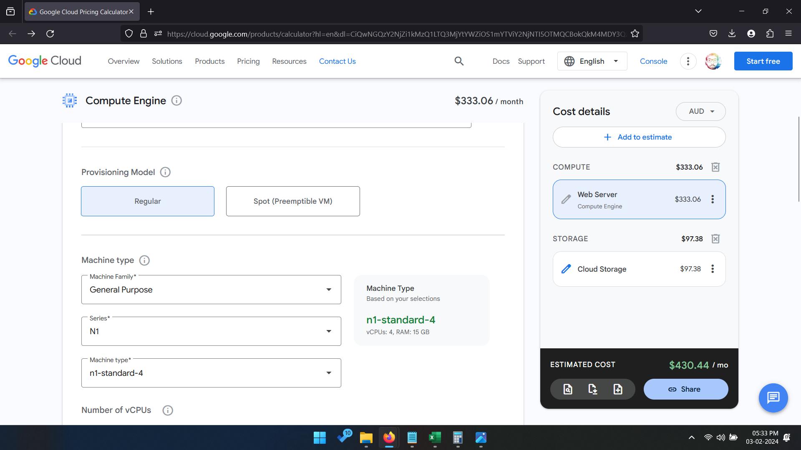
Also we chose SSD persistant disk because we felt that it will give better performance
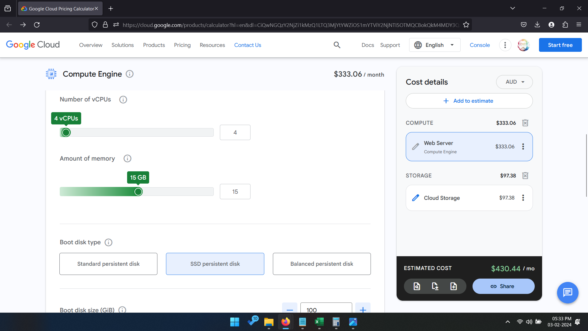
The region we chose was Melbourne Southeast-2
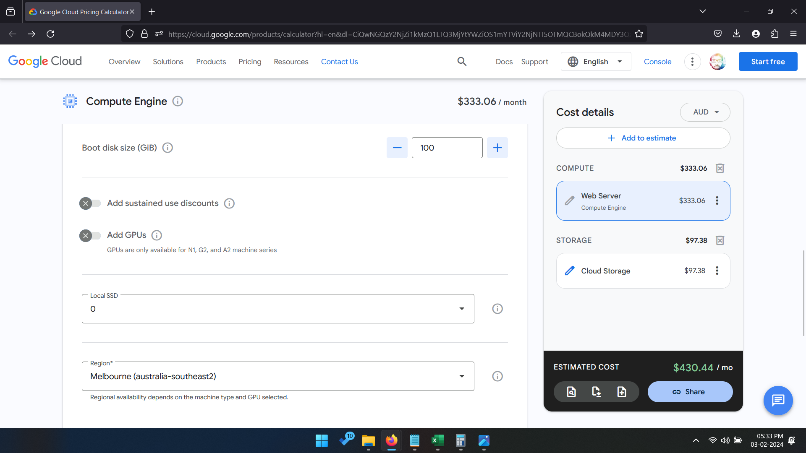

**Google Cloud Standard Storage**:

The storage class was standard HDD storage and the region we chose is Melbourne:
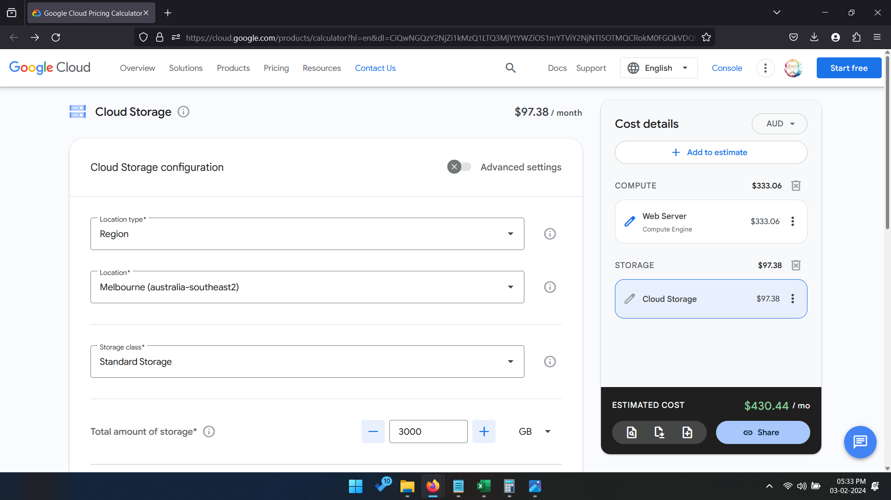
The source and destination region was oceania:
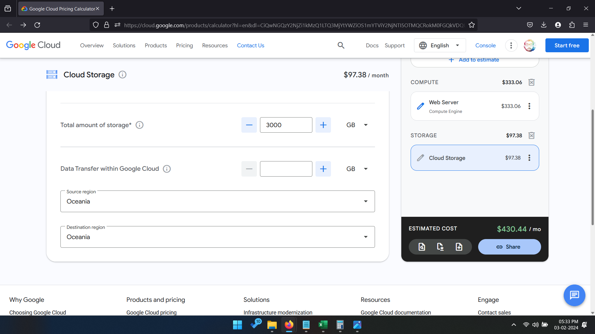
Below is the final pricing estimate/Quotation from Google Cloud:
The region we chose was Melbourne Southeast-2
.png)

Lets move onto **Amazon Web Services**:

**Amazon Cloud Standard Storage(EC2):**
So we chose local zone as Chicago because australia is very expensive regarding the service:
Below is both prices;
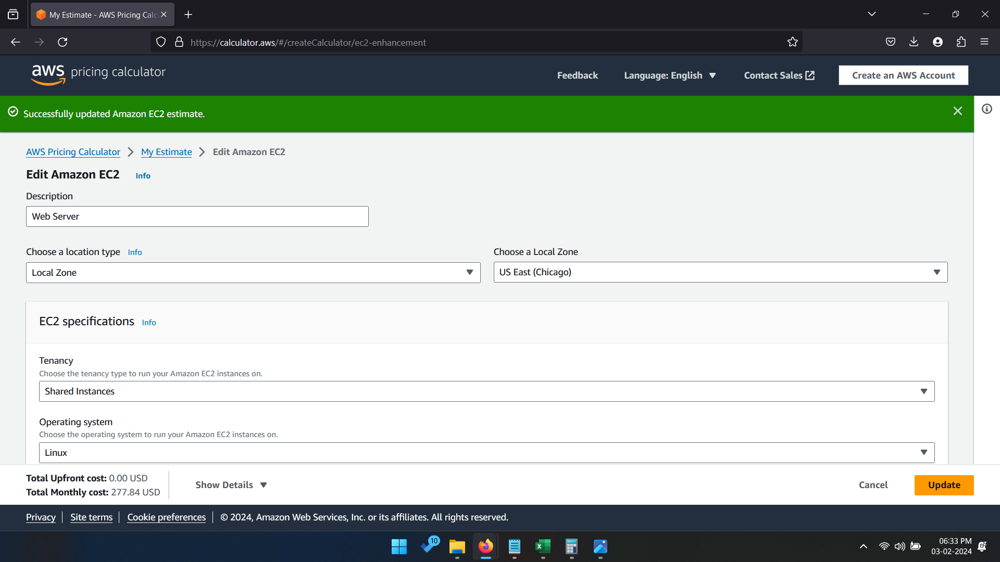
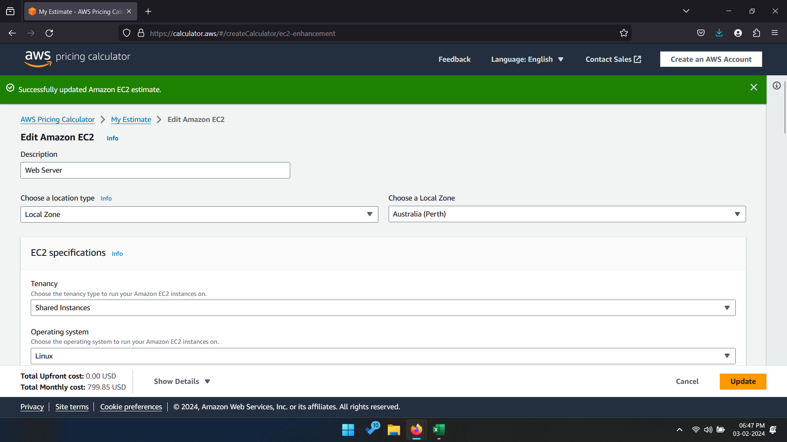
Hence We opted to go with Chicago.

Okay so in instance we selected 1 instance and constant usage because we will need to use it concurrently:

We selected the t3.xlarge regarding the CPU we chose 16 gb (couldnt find 15 gb similar to google cloud) and 4VCPUS (akin to gcloud):
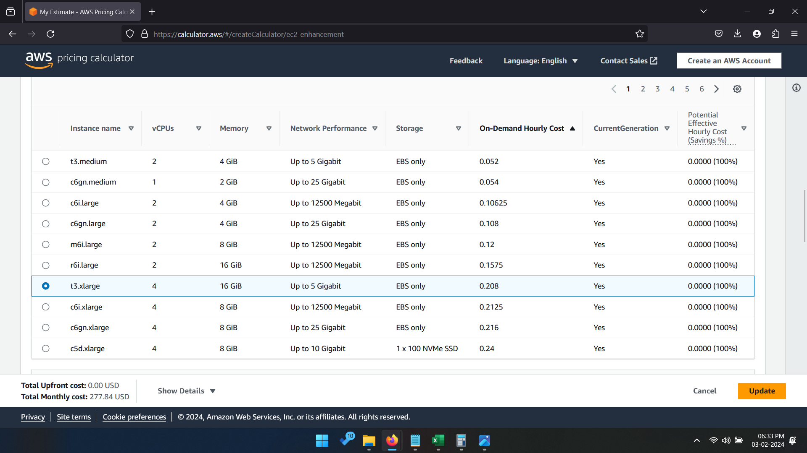
Also for storage we used the EBS 3000 GB storage:
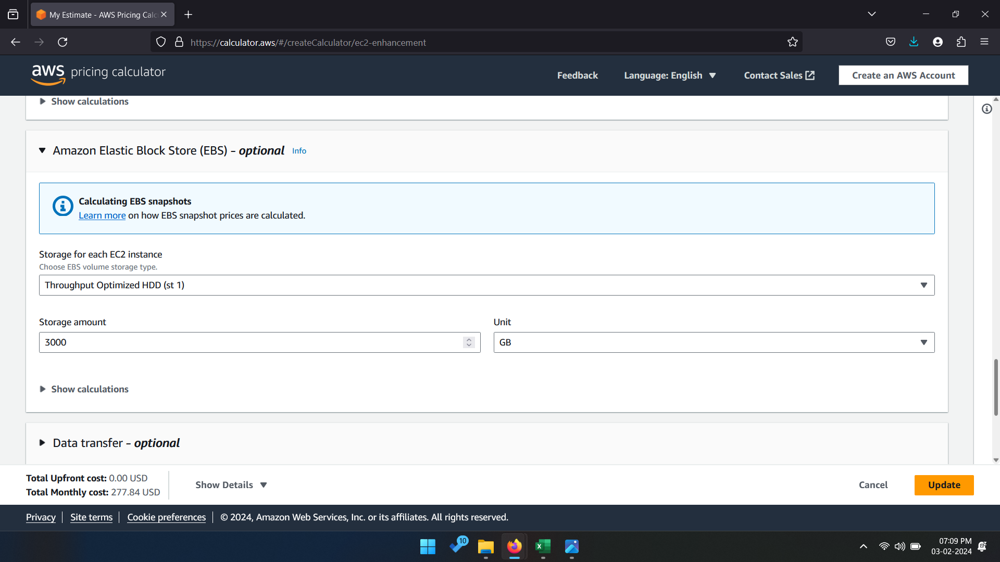

**Amazon Web Server (LightSail):**

We selected only lightsail virtual server:
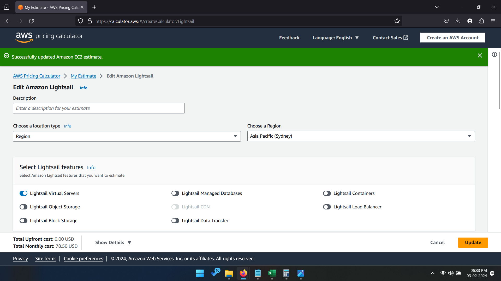
We selected linux as operating system:
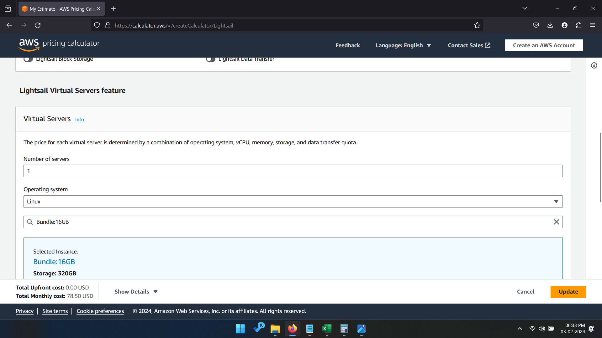
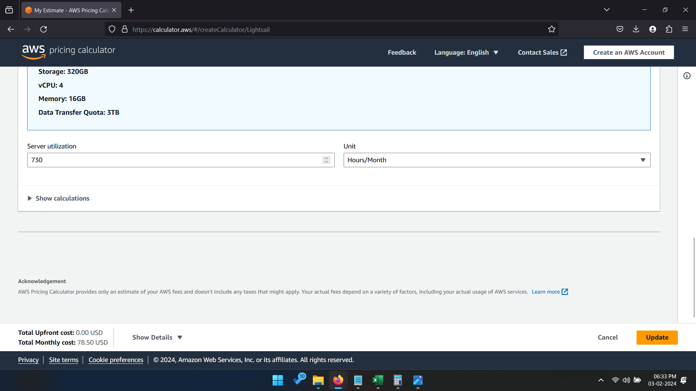

Below is the final pricing estimate/quotation from amazon web services:
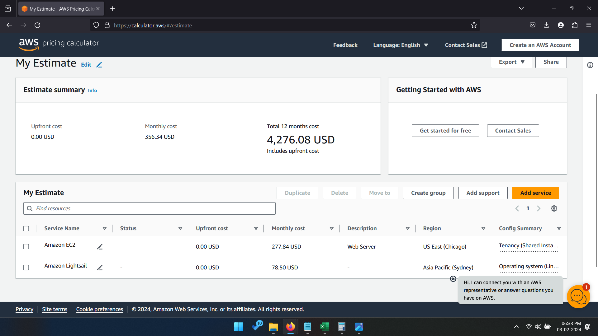

Below is a PRICING COMPARISON Table that I have created:
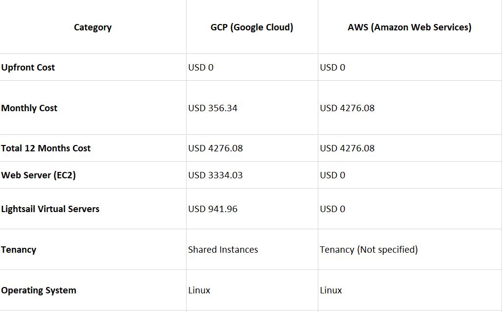

Below is a feature Comparison Table as well:
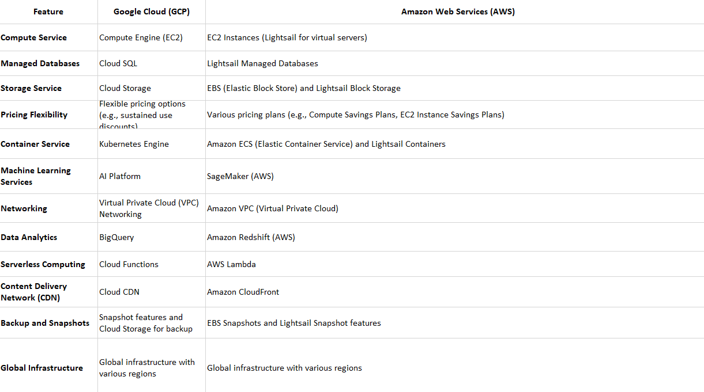

**Below are the Price Estimate Files for both AWS and Google Cloud:**

[**PriceEstimateAmazonWebServices**](./images/AWSEstimateRestuarant.csv)

[**PriceEstimateGoogleCloud**](./images/GoogleEstimate.csv)

**Annual Cost for Amazon Web Services is: $6566.73 AUD**

**Annual Cost for Google Cloud Services is: $5233.21 AUD****

Below are the current conversion rates for the prices according to current rate:
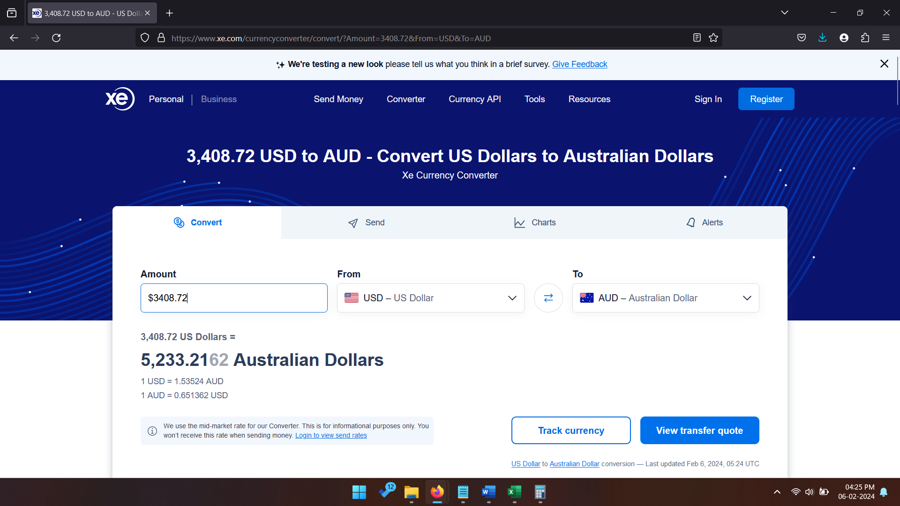

**Conclusion:**
**We Recommend Google Cloud for the Company.**
**The Reason for that is Google is reputed and Also very reliable, but the reason for our selection is that its Cheap.**

## Backup Strategies

**Backup Strategies for our Client(Retaurant):**
**Data Protection Policy:**

Data Protection and Backup Strategy for a Restaurant Business
Introduction

Developing a robust data protection and backup strategy is crucial for any business to ensure operational continuity and recoverability in the event of data loss. This report summarizes the key considerations and recommended approach for implementing a hybrid on-premise and cloud-based backup solution for a restaurant business.
Data Protection Policies

A clear data protection policy must identify and prioritize sensitive and mission-critical data assets to be backed up. Compliance and regulatory requirements relating to financial transactions, customer information, and employee records may dictate enhanced controls around certain data types. Regular employee training on data handling and backup protocols promotes a culture of data protection.
Backup Frequency

Automated daily backups of high-priority data provides maximum protection against information loss, whereas less frequent backups may suffice for lower priority data. Striking the right balance between backup overhead and risk exposure is key.
Backup Tools

Powerful hybrid backup tools that integrate both on-premise and cloud are recommended to provide redundancy across storage locations. Encrypted backups provide an added layer of protection against unauthorized access during transmission and storage.
Personnel and Responsibilities

Backup responsibilities should be formally assigned, whether to dedicated IT staff or contracted managed service providers. Ongoing monitoring of backup jobs, storage capacity, and data integrity is essential.

Advantages of a Hybrid Approach

    Redundancy across on-premise and cloud sites ensures availability despite localized outages
    Cost-effective to store less critical data on-premise while leveraging scalable cloud storage
    Easy to scale up cloud storage as needs grow

Disadvantages

    Increased complexity in managing both local and cloud repositories
    Dependence on internet connectivity makes cloud backup prone to disruption

Conclusion

A hybrid backup approach balances the information security of local storage with the flexibility and resiliency offered by cloud backup capabilities. For a restaurant business, this provides comprehensive protection for vital data assets while remaining cost-effective. Ongoing oversight of policies, backup monitoring and testing is essential for optimal data protection.

Advantages of Hybrid Backup Approach:

    Provides redundancy across on-premise and cloud to ensure availability despite localized failures
    Cost-effective to store less critical data on-premise while leveraging scalable cloud storage
    Easy to expand cloud storage as needs increase without on-premise infrastructure investment

Disadvantages of Hybrid Backup Approach:

    Increased complexity in managing both local and cloud repositories
    Dependence on reliable internet connectivity makes cloud backup prone to disruption

Conclusion:

    The hybrid approach balances on-premise security with cloud flexibility and resilience
    Comprehensive data protection for a restaurant business while remaining cost-effective
    Ongoing oversight of policies, monitoring, and testing key for optimal protection

## Backup Strategies For Central Queensland University Student:

according to our research, There are 3 main tools a CQU IT student needs in order to backup and protect there data,
these 3 tools are mainly,

Google Drive
File Hstory
Physical External Hard drive

We have selected these 3 tools because firstly google drive is very collaborative and different people can work on it. Suppose they are working on a same project, google drive can be very handy.

File history is very important because it provides version recovery which is very essential for a student in case data is lost. and external hard drive acts as a protection, in which there is a copy of all the data.

## The advantages of google drive is...
it can provide access to different people
many people can access same file
a person can access the same file from different types of devices.
Time machine automates manual backups, saving time
External hard drive offers extra protection

## The disadvantages
Free cloud storage may have its management limits 
local backup work only if the device works, if the device is lost, no one can recover the data

